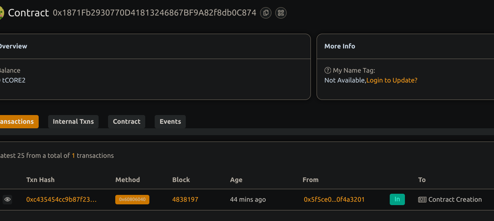

#   Basic Escrow Service for Peer-to-Peer Transactions

##  Project Description
A simple smart contract that facilitates a secure escrow system for peer-to-peer (P2P) payments. This ensures funds are held safely until a designated arbiter approves release to the payee, protecting both buyers and sellers in online transactions.

## Project Vision
To eliminate trust issues in peer-to-peer financial interactions by using a decentralized, transparent, and code-enforced escrow mechanism. This solution empowers users to transact safely without reliance on third-party services or intermediaries.

## Key Features
- **Payer-Funded Escrow**: The contract is initialized and funded by the payer.
- **Arbiter Control**: A neutral third party (arbiter) is given authority to release or refund funds.
- **One-Time Transfer Logic**: Ensures that funds can only be released once.

## Future Scope

- Add multi-party arbitration with voting mechanisms.
- Implement a dispute resolution system via DAO or staking-based governance.
- Introduce milestone-based payment release for service-based contracts.
- Integrate with   frontend for real-time escrow management.

## Contract details
0x1871Fb2930770D41813246867BF9A82f8db0C874

